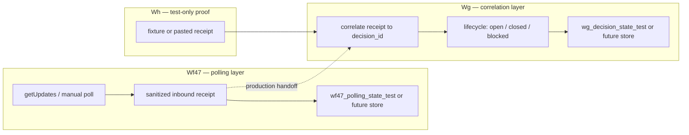

# Wf47 → Wg operationalization plan (no-runtime)

**Repository:** `mrhz1973/control-plane`  
**Document:** `docs/workflow-wf47-wg-operationalization-plan.md`  
**Status:** **PREP PASS** (plan) + **PREP PASS** (checklist) — planning only. **Not activation.** No runtime executed for this artifact.

This document is **canonical** for the Wf47 → Wg operationalization path. The checklist ([workflow-wf47-wg-operationalization-checklist.md](workflow-wf47-wg-operationalization-checklist.md)) is only a minimum readiness pointer and does not duplicate governance.

---

## 1. Purpose and scope

This plan defines the **single bounded path** from the validated **test-only** chain (Wf47 / Wg / Wh, all manual PASS) toward a future **operational** Wf47 → Wg inbound Decision Packet path — while every step until an explicit gate remains **manual / inactive / off**.

Per the anti-bureaucracy / momentum rule (PROJECT_VISION §7.9), this path is **bounded, not multiplied**: no repeated pre-pass / pre-pre-pass documents for the same chain unless a **new concrete, named risk** appears.

It does **not** authorize schedule, Telegram Trigger, public webhook, production Data Tables, PM-34 unlock, or workflow 40/41/42 changes.

---

## 2. Validated baseline (do not re-litigate)

| Artifact | State |
|----------|--------|
| **Wf47** Data Table manual validation | **PASS** — offset/idempotency on `wf47_polling_state_test` |
| **Wg** inbound Decision Packet state correlation manual validation | **PASS** — valid_close, duplicate, unknown on `wg_decision_state_test` |
| **Wh** Wf47 → Wg combined inbound decision flow manual validation | **PASS** — workflow **49** manual/inactive/off; fixture handoff + CSV seeds |
| **Workflow 49** | **manual / inactive / off** — integration proof, not production automation |
| **Telegram inbound operational automation** | **NOT RUN / NOT ACTIVE** |
| **PM-34** | **BLOCCATO** |

Related runbooks: [Wf](workflow-wf-telegram-inbound-polling-getupdates.md), [Wg](workflow-wg-telegram-inbound-decision-state-correlation.md), [Wh](workflow-wh-wf47-wg-combined-inbound-decision-flow.md). CSV convention: [DATA_TABLE_CSV_CONVENTION.md](foundation/DATA_TABLE_CSV_CONVENTION.md).

---

## 3. Handoff boundary (target architecture)

| Layer | Owns | Does not own |
|-------|------|----------------|
| **Wf47** (workflow 47) | Telegram polling/getUpdates; parse TEST ONLY `dp:…` replies; **sanitized inbound receipt**; polling offset / idempotency store | Decision lifecycle close rules; production `control_plane_state` |
| **Wg** (workflow 48) | Map receipt → **Decision Packet state**; transitions (close, duplicate, unknown, note); persist decision row | Live Telegram HTTP; schedule |
| **Wh** (workflow 49) | **Test-only** end-to-end proof (fixture → Wf47 guard → Wg correlate) | Operational automation; live poll in combined template (deferred) |

**Production handoff (future):** Wf47 emits a **sanitized receipt JSON** (same contract as manual validation). Wg consumes that receipt only — no raw Telegram bodies in Git or cross-workflow payloads with secrets.

---

## 4. Bounded path (no increment ladder)

The PREP-heavy multi-increment ladder is **retired**. The path is now bounded.

**Current state:**

- Wf47 → Wg operationalization **plan**: **PREP PASS**.
- Wf47 → Wg operationalization **checklist**: **PREP PASS**.

**Next state — one bounded final manual runtime rehearsal:**

- **Test-only and inactive/off** (user in n8n UI). One bounded rehearsal, not a series of separate docs-only gates.
- It **may include**:
  - **import/reimport rehearsal** of wf47 / wg / wf49 from GitHub (verify `active: false`; no schedule node; no Telegram Trigger on inbound path), and
  - **up to 2 repeat manual runs** (Wf47 manual poll → Wg correlation via fixture/handoff, on `*_test` tables only; record sanitized receipts).

**After the rehearsal — exactly one of:**

- **advance to the next real operational gate** (a concrete runtime/security gate), or
- **mark BLOCKED with a concrete blocker** (named, specific).

**Bound:** do not exceed **1 import/reimport rehearsal + 2 repeat manual runs** for this chain. Beyond that, do not open new pre-pass documents — advance or mark BLOCKED.

**Optional scenarios (`note_only`, `malformed`, `stale_closed`):** **not default.** They require a **named risk** to be run; absent a named risk, they are skipped, not gated as separate steps.

**Evidence quality:** **non-deterministic test evidence must not be used for PASS.** PASS requires deterministic expected output, hash/commit evidence, or explicit user-attested runtime output (PROJECT_VISION §7.9).

**Wh vs split workflows:** Wh proves correlation in one manual graph. The operational path likely remains **Wf47 then Wg** (two inactive workflows + handoff contract), not activating Wh for production.

---

## 5. Hard blockers (never without explicit gate)

| Blocker | Reason |
|---------|--------|
| **Schedule Trigger** on inbound path | Becomes unsupervised automation |
| **Telegram Trigger** | Requires public HTTPS webhook (We live BLOCKED) |
| **Public webhook** / `setWebhook` | Same; tunnel-only n8n insufficient |
| **`control_plane_state`** or production Data Table | No proof on production store yet |
| **PM-34 unlock** | Full autonomous chain not gated |
| **Mutation of workflow 40 / 41 / 42** | Production polling and MVP paths frozen |
| **Secrets in Git** | Token, credential id/content, webhook URL, API key, OAuth, PAT, CoT, tokenized URLs |
| **Activating wf49 for production** | Wh is test-only integration proof |

---

## 6. Rollback and fallback

| Situation | Action |
|-----------|--------|
| Any ambiguous receipt or double-close | Stop; leave all inbound workflows **inactive/off** |
| Wrong table state | **CSV reimport** for `wf47_polling_state_test` / `wg_decision_state_test` only ([data-tables/README.md](../data-tables/README.md)) |
| Wf47/Wg drift from Git template | Re-import from GitHub; do not edit production wf40–42 |
| Handoff contract unclear | Fall back to **manual Telegram / ChatGPT gate** (human reads reply; no automated correlation) |
| Schedule or prod table requested early | **Reject** — open new explicit gate doc; do not fold into this plan |

---

## 7. PASS criteria — this planning task

| Criterion | Met when |
|-----------|----------|
| No runtime executed by Cursor | Yes — docs only |
| No workflow JSON changed | Yes — `workflows/**` untouched |
| No `data-tables/` changed | Yes |
| No secrets committed | Yes |
| Plan document complete | This file + frontier PREP entry |
| **Next gate identified** | **One bounded final manual runtime rehearsal** (§4): import/reimport + up to 2 repeat manual runs, then advance or BLOCKED |

**Next gate (after this PREP):** one bounded **Wf47/Wg/Wh final manual runtime rehearsal**, test-only and inactive/off — import/reimport rehearsal plus up to 2 repeat manual runs. After that, **advance to the next real operational gate or mark BLOCKED with a concrete blocker**. No optional scenario testing unless a named risk appears. Still no schedule, no production Data Table, no PM-34.

---

## 8. Boundaries (unchanged)

- Telegram inbound **operational** automation: **NOT ACTIVE**
- Telegram Decision Packet **operational** automation: **NOT RUN**
- Catena completa automatizzata: **NOT RUN** (PM-34)
- Wf47 / Wg / Wh manual validations: **PASS** (preserved)
