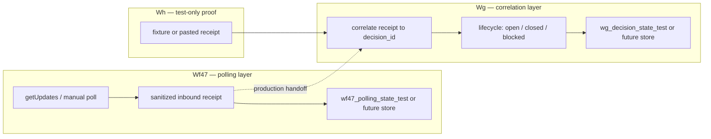

# Wf47 → Wg operationalization plan (no-runtime)

**Repository:** `mrhz1973/control-plane`
**Document:** `docs/workflow-wf47-wg-operationalization-plan.md`
**Status:** **PREP PASS** (plan + checklist) + **final bounded manual runtime rehearsal PASS ATTESTATO UTENTE** + **bounded automatic 47→48 handoff PASS ATTESTATO UTENTE** (2026-07-09). Workflows 47/48/49 remain **manual / inactive / off**. Not operational activation.

This document is **canonical** for the Wf47 → Wg operationalization path. The checklist ([workflow-wf47-wg-operationalization-checklist.md](workflow-wf47-wg-operationalization-checklist.md)) is only a minimum readiness pointer and does not duplicate governance.

---

## 1. Purpose and scope

This plan defines the **single bounded path** from the validated **test-only** chain (Wf47 / Wg / Wh, all manual PASS) toward a future **operational** Wf47 → Wg inbound Decision Packet path — while every step until an explicit gate remains **manual / inactive / off**.

Per the anti-bureaucracy / momentum rule (PROJECT_VISION §7.9), this path is **bounded, not multiplied**: no repeated pre-pass / pre-pre-pass documents for the same chain unless a **new concrete, named risk** appears.

It does **not** authorize schedule, Telegram Trigger, public webhook, production Data Tables, PM-34 unlock, or workflow 40/41/42 changes.

---

## 2. Validated baseline (do not re-litigate)

| Artifact | State |
|----------|--------|
| **Wf47** Data Table manual validation | **PASS** — offset/idempotency on `wf47_polling_state_test` |
| **Wg** inbound Decision Packet state correlation manual validation | **PASS** — valid_close, duplicate, unknown on `wg_decision_state_test` |
| **Wh** Wf47 → Wg combined inbound decision flow manual validation | **PASS** — workflow **49** manual/inactive/off; fixture handoff + CSV seeds |
| **Final bounded manual runtime rehearsal** | **PASS ATTESTATO UTENTE** — workflow **49** in n8n UI; 3 deterministic runs (valid_close, duplicate, unknown); workflows 47/48/49 present, inactive/off |
| **Controlled 47 → 48 runtime PASS** | **PASS ATTESTATO UTENTE** (2026-06-01) — callable handoff; `update_id` **986228567** |
| **Bounded automatic 47 → 48 handoff** | **PASS ATTESTATO UTENTE** (2026-07-09) — `D-3045-T`; `update_id` **986228600**; `selected_option` **1**; Execute Workflow reference to workflow 48 (`iTXuuFbMLmc9sUdf`); test window only with `enable_wg48_handoff=true`, restored to **false** after run |
| **Workflow 49** | **manual / inactive / off** — integration proof, not production automation |
| **Telegram inbound operational automation** | **NOT RUN / NOT ACTIVE** |
| **PM-34** | **BLOCCATO** |

Related runbooks: [Wf](workflow-wf-telegram-inbound-polling-getupdates.md), [Wg](workflow-wg-telegram-inbound-decision-state-correlation.md), [Wh](workflow-wh-wf47-wg-combined-inbound-decision-flow.md). CSV convention: [DATA_TABLE_CSV_CONVENTION.md](foundation/DATA_TABLE_CSV_CONVENTION.md).

---

## 3. Handoff boundary (target architecture)



| Layer | Owns | Does not own |
|-------|------|----------------|
| **Wf47** (workflow 47) | Telegram polling/getUpdates; parse TEST ONLY `dp:…` replies; **sanitized inbound receipt**; polling offset / idempotency store | Decision lifecycle close rules; production `control_plane_state` |
| **Wg** (workflow 48) | Map receipt → **Decision Packet state**; transitions (close, duplicate, unknown, note); persist decision row | Live Telegram HTTP; schedule |
| **Wh** (workflow 49) | **Test-only** end-to-end proof (fixture → Wf47 guard → Wg correlate) | Operational automation; live poll in combined template (deferred) |

**Production handoff (future):** Wf47 emits a **sanitized receipt JSON** (same contract as manual validation). Wg consumes that receipt only — no raw Telegram bodies in Git or cross-workflow payloads with secrets.

---

## 4. Bounded path (no increment ladder)

The PREP-heavy multi-increment ladder is **retired**. The bounded path is **complete**.

**Completed state:**

- Wf47 → Wg operationalization **plan**: **PREP PASS**.
- Wf47 → Wg operationalization **checklist**: **PREP PASS**.
- **Final bounded manual runtime rehearsal**: **PASS ATTESTATO UTENTE** (2026-05-31).

**Rehearsal outcome:**

- **import/reimport not needed** — workflows 47, 48, and 49 were already present in n8n UI, inactive/off.
- **3 essential deterministic runs passed** on workflow 49: `valid_close`, `duplicate`, `unknown` (user-attested sanitized receipts).
- **Optional scenarios** (`note_only`, `malformed`, `stale_closed`) **not run** — no named risk required them.
- **No non-deterministic evidence** used for PASS.
- Workflows 47/48/49 remained **test-only / inactive / off** throughout. No schedule, Telegram Trigger, public webhook, production Data Table, or `control_plane_state`.

**Next step:** a **separate real operational gate** — not more prep churn for this chain. Do not create additional PREP/PRE-PREP documents unless a **new named risk** appears.

**Bound satisfied:** 1 import/reimport rehearsal (skipped — already present) + 3 deterministic manual runs (within max 2 repeat + initial run allowance). Per PROJECT_VISION §7.9, advance to next real gate or mark BLOCKED — rehearsal **PASS**, so **advance**.

**Optional scenarios (`note_only`, `malformed`, `stale_closed`):** **not default.** They require a **named risk** to be run; absent a named risk, they are skipped, not gated as separate steps.

**Evidence quality:** **non-deterministic test evidence must not be used for PASS.** PASS requires deterministic expected output, hash/commit evidence, or explicit user-attested runtime output (PROJECT_VISION §7.9).

**Wh vs split workflows:** Wh proves correlation in one manual graph. The operational path likely remains **Wf47 then Wg** (two inactive workflows + handoff contract), not activating Wh for production.

### 4bis. Live gate discovery (2026-06-01) — concrete blocker fix

During the **first live manual gate** (47 → manual sanitized receipt → 48):

- **47 - Wf** live `getUpdates` produced a valid **accepted** sanitized receipt — **PASS ATTESTATO UTENTE** (not re-tested by this task).
- **48 - Wg** could **not** consume it: node *Build sanitized inbound test input* only built internal fixtures and explicitly simulated Wf47 receipts.
- **Fix (not a new PREP chain):** add **`external_receipt`** scenario + **`manual_receipt_json`** on 48 - Wg template. Fixture scenarios (`valid_close`, `duplicate`, `unknown`, `stale_closed`, `note_only`, `malformed`) unchanged.

**Blocker fixed:** `external_receipt` + `manual_receipt_json` on 48 - Wg (commit `18c9dd0`).

**Live manual 47→48 handoff:** **PASS ATTESTATO UTENTE** (2026-06-01). Real Telegram `getUpdates` receipt from **47 - Wf** (`update_id` 986228561, `D-9998-T` accepted) was manually handed to **48 - Wg**; **D-9998-T** closed from `prior_status: open`, `state_persisted: true`. Value proven: split workflows + paste handoff works without Wh (49) for this gate.

**Next work:** separate operational gate — first limited **schedule test for 47 - Wf only** (test-only, reversible), or BLOCKED with concrete blocker. **Not** another PREP/PRE-PREP doc for this chain.

### 4ter. Schedule test blocker — Phase 1 template ready (2026-06-01)

- **47→48 live handoff:** **PASS ATTESTATO UTENTE** (unchanged).
- **Next gate:** schedule test limited to **47 - Wf only**.
- **Blocker found:** `wf-telegram-inbound-polling-getupdates.template.json` had **only Manual Trigger** — repeatable schedule test required a versioned template change (not ad hoc n8n UI).
- **Phase 1 fix:** add **Schedule Trigger - TEST ONLY DISABLED** (`every 1 minute`, `disabled: true`, workflow `active: false`) connected to **Set Wf47 UI config**. **No runtime** in Phase 1.
- **Phase 2:** manual/user-attested — reimport 47, reset test table, verify no webhook/other getUpdates consumer, 5–10 min schedule window, accept-once test, turn off immediately.

### 4quinquies. 47 - Wf schedule gate PASS (2026-06-01)

- **47 - Wf schedule gate:** **PASS ATTESTATO UTENTE** — first limited scheduled `getUpdates` test on workflow 47 only.
- **Value proven:** scheduled polling can accept **one** Telegram Decision Packet response (`update_id` 986228565) and **avoid re-accepting** it on the next cycle.

### 4sexies. Controlled 47 → 48 handoff template (Phase 1, 2026-06-01)

- **Status:** template **IMPLEMENTATION READY** — removes manual copy/paste between 47 and 48; **not** a PREP/PRE-PREP chain.
- **47:** `enable_wg48_handoff=false` default; IF short-circuits before Execute Workflow; no hardcoded 48 workflow id (`CONFIGURE_48_WORKFLOW_REFERENCE_IN_N8N_UI`).
- **48:** callable entry **When Executed by Another Workflow** → **Normalize Wf47 callable receipt** (does **not** use **Set Wg test scenario**) → same **Correlate inbound to decision state** path as manual fixtures / `external_receipt`.
- **Phase 2 runtime:** reimport 47 + 48, keep both inactive until gate, reset test tables, wire 48 reference in n8n UI, enable handoff only for test window, verify one accept + 48 closes D-9998-T, turn 47 off immediately.

### 4septies. Controlled 47 → 48 runtime PASS (2026-06-01)

- **Status:** controlled **47→48** runtime **PASS ATTESTATO UTENTE** — `update_id` **986228567**; **D-9998-T** closed via callable **48 - Wg** (not manual paste).
- **47** turned off after test window; **48** published as callable subworkflow only (not scheduled).
- **Not** a PREP/PRE-PREP chain. Boundaries unchanged: no **49**, no wf40/41/42, no PM-34, no production tables, no public webhook, no Telegram Trigger.

### 4octies. Shared decision store — open/close contract (Gate 1 design, 2026-06-01)

- **Gap named:** outbound (Wd/Wc) sends Decision Packet but does **not** write **open**; inbound (Wg) closes **manually seeded** `wg_decision_state_test`; **control_plane_state** is SHA tracking for wf40 — **not** a decision store.
- **Direction chosen:** shared test-only table **`control_plane_decisions_test`** — open on send, close on reply — **not** redundant PREP; concrete design for a real loop gap.
- **Design doc:** [decision-store-shared-open-close-design.md](decision-store-shared-open-close-design.md).
- **Gate 1:** design **PASS** (docs-only). **Gate 2** template no-runtime; **Gate 3** runtime user-attested — **not started**.
- **Operational loop:** **NOT ACTIVE / NOT RUN** — design only.

### 4nonies. Shared decision store — Gate 2 template no-runtime (2026-06-01)

- **Status:** **IMPLEMENTATION READY / PASS** (template + docs only). **No runtime.**
- **Wd:** loads `control_plane_decisions_test`, prepares open row, gates Telegram with **IF shared decision open allowed**, upserts **open** before send; closed id → `blocked` (`duplicate_open_attempt`), no reopen, no send.
- **Wg:** **Load/Upsert shared decision** nodes target `control_plane_decisions_test` (was `wg_decision_state_test`); Correlate carries `updated_at`/`created_by`/`source_workflow`/`packet_kind`.
- **We:** placeholder documented to resolve to `control_plane_decisions_test` (template unchanged).
- **Named risk `open_without_send`:** open row may precede a failed Telegram send — verified at **Gate 3 runtime user-attested**, not here.
- **Boundaries:** both templates `active: false`; no `data-tables/**`; no CSV seed; no table created in repo; no `control_plane_state`; no wf40/41/42; no PM-34; no 49; no Schedule/Telegram Trigger/webhook; no secrets.
- **Gate 3:** runtime user-attested end-to-end open→close on shared store — **NEXT / NOT STARTED**.

### 4decies. Shared decision store — Gate 3 runtime end-to-end PASS (2026-06-02)

- **Status:** **PASS ATTESTATO UTENTE** — test-only loop, **not** production automation.
- **Path:** **45 Wd open-on-send** → Telegram reply → **47 Wf accept** (`update_id` **986228569**) → **48 Wg close** → `control_plane_decisions_test` **closed**.
- **Wd:** `telegram_send_ok: true`, `open_action: insert`, `decision_id: D-9998-T`; shared store row `open` before inbound.
- **Wg:** `prior_status: open`, `state_persisted: true`, final `status: closed`.
- **Risk `open_without_send`:** not observed in this run.
- **Cleanup:** **47** off after test window; **48** callable/published, not scheduled independently; **40/42** unchanged; **49** not used; **PM-34** **BLOCKED**.
- **Temporary routing:** classifier Ryzen + reverse SSH tunnel + VPS Python bridge — Gate 3 evidence only.
- Session: `docs/sessions/2026-06-02-control-plane-decision-store-gate3-runtime-pass.md`. **No** new PREP/PRE-PREP.

### 4undecies. Bounded automatic 47 → 48 handoff PASS (2026-07-09)

- **Status:** **PASS ATTESTATO UTENTE** — bounded test-only runtime arc; **not** operational activation; **not** Gate E full PASS; **not** global PASS runtime.
- **Path validated:**
  - **47 - Wf** Telegram inbound polling getUpdates
  - **48 - Wg** Telegram decision state correlation
  - **47** Execute Workflow reference → workflow **48** id `iTXuuFbMLmc9sUdf` (operator-verified in n8n UI; local editor URL pattern `http://localhost:5678/workflow/iTXuuFbMLmc9sUdf`)
- **Runtime test (single bounded run):**
  - `decision_id`: **D-3045-T**
  - Operator Telegram reply: `dp:D-3045-T:1`
  - **Execute Workflow - Wg48 TEST ONLY** final output (1 item):

```json
{
  "inspect_status": "closed",
  "decision_id": "D-3045-T",
  "selected_option": "1",
  "update_id": 986228600,
  "note_present": false,
  "block_reason": null,
  "prior_status": "open",
  "state_persisted": true,
  "test_only": true
}
```

- **Temporary runtime config (test window only):**
  - **Build getUpdates request from state:** `open_decision_ids_test_only: ['D-3045-T']`
  - **Set Wf47 UI config:** `enable_wg48_handoff = true`
  - **Authorization note:** flip temporaneo `enable_wg48_handoff` autorizzato da **decisione utente esplicita in chat** (2026-07-09); **Decision Packet non emesso**.
- **wf48 scope (clarification):** nessuna modifica a **wf48** in questo arco. Nessun fix UI wf48 pendente nei record: i riferimenti fan-out in **GE-02** sono l'instrumentazione del fix **wf45** (PR #1); il fix template **wg48** "safe branch input" (`177f973`) è già consolidato in repo.
- **Post-test restore (operator-completed):**
  - `enable_wg48_handoff = false`
  - `open_decision_ids_test_only: ['D-1003-T']`
  - No Execute after restore · no Publish · no Active · no permanent Schedule · no public webhook · no Telegram Trigger
- **Table hygiene (operator-completed):**
  - `control_plane_decisions_test` contains only: **D-1003-T** closed, **D-3045-T** closed, **D-8019-T** closed, **D-4218-T** closed
  - Noisy test rows removed (including **D-GE-SENDOK-*** and unused random test IDs)
  - `wf47_polling_state_test` after run: `last_update_id = 986228601`, `last_handled_update_id = 986228600`
  - `wg_decision_state_test` inspected and **left untouched**
- **Limitation (historical 2026-07-09 arc):** that bounded handoff passed with `selected_option=1` on a **1/2/3** tested path.
- **Parser status after D-0050-W / D-0052-W (2026-07-17):** repository parser supports options **1–5**. D-0052-W L4 harness **runtime-validated option 5**. Option **4** was **not** individually runtime-tested. **Do not** write that all options 1–5 were runtime validated.
- **D-0054-W official inventory restore (2026-07-17):** configuration-only UI restore from live canonical template; `result_runtime=NOT_RUN_CONFIGURATION_ONLY`; `wf47_official_inventory_status=PRESENT_IN_FINAL_N8N_LIST`; `l5_inventory_blocker_resolved=true`; **`l5_activation_authorized=false`**; zero executions; **not** a runtime PASS.
- **Boundaries unchanged:** PM-34 **BLOCKED** · `n8n_ready` **false** · `pm34_unblocked` **false** · `enable_wg48_handoff` **false** (restored) · wf40/41/42 untouched · no production activation · Cursor **did not** run n8n.

---

## 5. Hard blockers (never without explicit gate)

| Blocker | Reason |
|---------|--------|
| **Schedule Trigger** on inbound path | Becomes unsupervised automation |
| **Telegram Trigger** | Requires public HTTPS webhook (We live BLOCKED) |
| **Public webhook** / `setWebhook` | Same; tunnel-only n8n insufficient |
| **`control_plane_state`** or production Data Table | No proof on production store yet |
| **PM-34 unlock** | Full autonomous chain not gated |
| **Mutation of workflow 40 / 41 / 42** | Production polling and MVP paths frozen |
| **Secrets in Git** | Token, credential id/content, webhook URL, API key, OAuth, PAT, CoT, tokenized URLs |
| **Activating wf49 for production** | Wh is test-only integration proof |

---

## 6. Rollback and fallback

| Situation | Action |
|-----------|--------|
| Any ambiguous receipt or double-close | Stop; leave all inbound workflows **inactive/off** |
| Wrong table state | **CSV reimport** for `wf47_polling_state_test` / `wg_decision_state_test` only ([data-tables/README.md](../data-tables/README.md)) |
| Wf47/Wg drift from Git template | Re-import from GitHub; do not edit production wf40–42 |
| Handoff contract unclear | Fall back to **manual Telegram / ChatGPT gate** (human reads reply; no automated correlation) |
| Schedule or prod table requested early | **Reject** — open new explicit gate doc; do not fold into this plan |

---

## 7. PASS criteria — this planning task

| Criterion | Met when |
|-----------|----------|
| No runtime executed by Cursor | Yes — docs only |
| No workflow JSON changed | Yes — `workflows/**` untouched |
| No `data-tables/` changed | Yes |
| No secrets committed | Yes |
| Plan document complete | This file + frontier PREP entry |
| **Next gate identified** | Bounded automatic **47→48** handoff **PASS ATTESTATO UTENTE** recorded (2026-07-09, `D-3045-T`); operational automation remains **NOT ACTIVE** |

**Status:** bounded automatic **47→48** test-only handoff **PASS ATTESTATO UTENTE** (`update_id` **986228600**, `selected_option` **1**). **D-0052-W** (2026-07-17): L4 callback harness **PASS** option **5** + wf48 `external_receipt` close; at that teardown official wf47 was **absent** (historical). **D-0054-W** (2026-07-17): official wf47 inventory **restored** (`PRESENT_IN_FINAL_N8N_LIST`, configuration-only, `NOT_RUN_CONFIGURATION_ONLY`); L5 still **unauthorized**. Telegram inbound operational automation **NOT ACTIVE / NOT RUN**. PM-34 **BLOCKED**. `enable_wg48_handoff` **false**. No Gate E full PASS. No global PASS runtime. Parser: repository **1–5**; live option **5** PASS; option **4** **NOT_TESTED**.

---

## 8. Boundaries (unchanged)

- Telegram inbound **operational** automation: **NOT ACTIVE**
- Telegram Decision Packet **operational** automation: **NOT RUN**
- Catena completa automatizzata: **NOT RUN** (PM-34)
- Wf47 / Wg / Wh manual validations: **PASS** (preserved)
- Final bounded manual runtime rehearsal: **PASS ATTESTATO UTENTE**
- Bounded automatic **47→48** handoff (2026-07-09): **PASS ATTESTATO UTENTE** — `D-3045-T`; runtime restored; `enable_wg48_handoff` **false**
