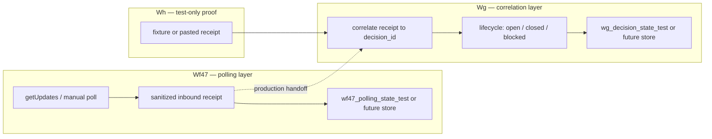

# Wf47 → Wg operationalization plan (no-runtime)

**Repository:** `mrhz1973/control-plane`  
**Document:** `docs/workflow-wf47-wg-operationalization-plan.md`  
**Status:** **PREP PASS** — planning only. **Not activation.** No runtime executed for this artifact.

---

## 1. Purpose and scope

This plan defines **safe, ordered increments** to move from validated **test-only** handoff (Wh) toward a future **operational** Wf47 → Wg inbound Decision Packet path — while every step until an explicit gate remains **manual / inactive / off**.

It does **not** authorize schedule, Telegram Trigger, public webhook, production Data Tables, PM-34 unlock, or workflow 40/41/42 changes.

---

## 2. Validated baseline (do not re-litigate)

| Artifact | State |
|----------|--------|
| **Wf47** Data Table manual validation | **PASS** — offset/idempotency on `wf47_polling_state_test` |
| **Wg** inbound Decision Packet state correlation manual validation | **PASS** — valid_close, duplicate, unknown on `wg_decision_state_test` |
| **Wh** Wf47 → Wg combined inbound decision flow manual validation | **PASS** — workflow **49** manual/inactive/off; fixture handoff + CSV seeds |
| **Workflow 49** | **manual / inactive / off** — integration proof, not production automation |
| **Telegram inbound operational automation** | **NOT RUN / NOT ACTIVE** |
| **PM-34** | **BLOCCATO** |

Related runbooks: [Wf](workflow-wf-telegram-inbound-polling-getupdates.md), [Wg](workflow-wg-telegram-inbound-decision-state-correlation.md), [Wh](workflow-wh-wf47-wg-combined-inbound-decision-flow.md). CSV convention: [DATA_TABLE_CSV_CONVENTION.md](foundation/DATA_TABLE_CSV_CONVENTION.md).

---

## 3. Handoff boundary (target architecture)

| Layer | Owns | Does not own |
|-------|------|----------------|
| **Wf47** (workflow 47) | Telegram polling/getUpdates; parse TEST ONLY `dp:…` replies; **sanitized inbound receipt**; polling offset / idempotency store | Decision lifecycle close rules; production `control_plane_state` |
| **Wg** (workflow 48) | Map receipt → **Decision Packet state**; transitions (close, duplicate, unknown, note); persist decision row | Live Telegram HTTP; schedule |
| **Wh** (workflow 49) | **Test-only** end-to-end proof (fixture → Wf47 guard → Wg correlate) | Operational automation; live poll in combined template (deferred) |

**Production handoff (future):** Wf47 emits a **sanitized receipt JSON** (same contract as manual validation). Wg consumes that receipt only — no raw Telegram bodies in Git or cross-workflow payloads with secrets.

---

## 4. Allowed future increments (strict order)

Each step requires its **own gate** (docs registration and/or user-attested manual PASS). Do not skip steps.

| Order | Increment | Runtime? | Notes |
|-------|-----------|----------|--------|
| **0** | This plan (PREP PASS) | No | Current document |
| **1** | Optional Wh scenarios (if needed) | Manual, wf49 inactive | `note_only`, `malformed`, `stale_closed` — only if product risk requires before live Wf47→Wg chain |
| **2** | No-runtime config checklist | No | Confirm: credential name in n8n only; test tables + CSV seeds; wf47/wf48/wf49 templates; chat_id in config assets per gate 2026-05-31; redaction rules in [workflows/README.md](../workflows/README.md) |
| **3** | Manual inactive/off import rehearsal | User in n8n UI | Re-import wf47, wg, wf49 from GitHub; verify `active: false`; no schedule nodes; no Telegram Trigger on inbound path |
| **4** | Test-only repeated manual run | User in n8n UI | Wf47 live poll (manual) → optional paste/trigger Wg OR Wh fixture path; tables `*_test` only; record sanitized receipts |
| **5** | Two-workflow handoff rehearsal (inactive) | User in n8n UI | Run Wf47 once; feed **sanitized receipt** into Wg (manual or sub-workflow call) — **no** combined active workflow |
| **6** | Separate gate: schedule / production table | Only after explicit owner gate | Schedule trigger, `control_plane_state`, or operational inbound **NOT** in this plan |

**Wh vs split workflows:** Wh proves correlation in one manual graph. Operational path likely remains **Wf47 then Wg** (two inactive workflows + handoff contract), not activating Wh for production.

---

## 5. Hard blockers (never without explicit gate)

| Blocker | Reason |
|---------|--------|
| **Schedule Trigger** on inbound path | Becomes unsupervised automation |
| **Telegram Trigger** | Requires public HTTPS webhook (We live BLOCKED) |
| **Public webhook** / `setWebhook` | Same; tunnel-only n8n insufficient |
| **`control_plane_state`** or production Data Table | No proof on production store yet |
| **PM-34 unlock** | Full autonomous chain not gated |
| **Mutation of workflow 40 / 41 / 42** | Production polling and MVP paths frozen |
| **Secrets in Git** | Token, credential id/content, webhook URL, API key, OAuth, PAT, CoT, tokenized URLs |
| **Activating wf49 for production** | Wh is test-only integration proof |

---

## 6. Rollback and fallback

| Situation | Action |
|-----------|--------|
| Any ambiguous receipt or double-close | Stop; leave all inbound workflows **inactive/off** |
| Wrong table state | **CSV reimport** for `wf47_polling_state_test` / `wg_decision_state_test` only ([data-tables/README.md](../data-tables/README.md)) |
| Wf47/Wg drift from Git template | Re-import from GitHub; do not edit production wf40–42 |
| Handoff contract unclear | Fall back to **manual Telegram / ChatGPT gate** (human reads reply; no automated correlation) |
| Schedule or prod table requested early | **Reject** — open new explicit gate doc; do not fold into this plan |

---

## 7. PASS criteria — this planning task

| Criterion | Met when |
|-----------|----------|
| No runtime executed by Cursor | Yes — docs only |
| No workflow JSON changed | Yes — `workflows/**` untouched |
| No `data-tables/` changed | Yes |
| No secrets committed | Yes |
| Plan document complete | This file + frontier PREP entry |
| **Next gate identified** | **Step 1 or 2** above: optional Wh scenarios **or** no-runtime config checklist + import rehearsal (user-attested) |

**Suggested next gate (after this PREP):** Execute **increment 2** (no-runtime config checklist review) then **increment 3** (manual inactive/off import rehearsal) — user-attested PASS registration only; still no schedule, no production Data Table, no PM-34.

---

## 8. Boundaries (unchanged)

- Telegram inbound **operational** automation: **NOT ACTIVE**
- Telegram Decision Packet **operational** automation: **NOT RUN**
- Catena completa automatizzata: **NOT RUN** (PM-34)
- Wf47 / Wg / Wh manual validations: **PASS** (preserved)
