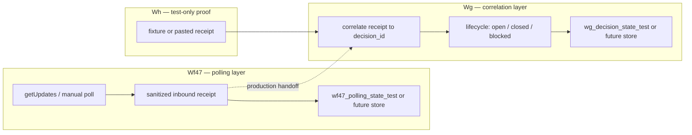

# Wf47 → Wg operationalization plan (no-runtime)

**Repository:** `mrhz1973/control-plane`  
**Document:** `docs/workflow-wf47-wg-operationalization-plan.md`  
**Status:** **PREP PASS** (plan + checklist) + **final bounded manual runtime rehearsal PASS ATTESTATO UTENTE**. Workflows 47/48/49 remain **manual / inactive / off**. Not operational activation.

This document is **canonical** for the Wf47 → Wg operationalization path. The checklist ([workflow-wf47-wg-operationalization-checklist.md](workflow-wf47-wg-operationalization-checklist.md)) is only a minimum readiness pointer and does not duplicate governance.

---

## 1. Purpose and scope

This plan defines the **single bounded path** from the validated **test-only** chain (Wf47 / Wg / Wh, all manual PASS) toward a future **operational** Wf47 → Wg inbound Decision Packet path — while every step until an explicit gate remains **manual / inactive / off**.

Per the anti-bureaucracy / momentum rule (PROJECT_VISION §7.9), this path is **bounded, not multiplied**: no repeated pre-pass / pre-pre-pass documents for the same chain unless a **new concrete, named risk** appears.

It does **not** authorize schedule, Telegram Trigger, public webhook, production Data Tables, PM-34 unlock, or workflow 40/41/42 changes.

---

## 2. Validated baseline (do not re-litigate)

| Artifact | State |
|----------|--------|
| **Wf47** Data Table manual validation | **PASS** — offset/idempotency on `wf47_polling_state_test` |
| **Wg** inbound Decision Packet state correlation manual validation | **PASS** — valid_close, duplicate, unknown on `wg_decision_state_test` |
| **Wh** Wf47 → Wg combined inbound decision flow manual validation | **PASS** — workflow **49** manual/inactive/off; fixture handoff + CSV seeds |
| **Final bounded manual runtime rehearsal** | **PASS ATTESTATO UTENTE** — workflow **49** in n8n UI; 3 deterministic runs (valid_close, duplicate, unknown); workflows 47/48/49 present, inactive/off |
| **Workflow 49** | **manual / inactive / off** — integration proof, not production automation |
| **Telegram inbound operational automation** | **NOT RUN / NOT ACTIVE** |
| **PM-34** | **BLOCCATO** |

Related runbooks: [Wf](workflow-wf-telegram-inbound-polling-getupdates.md), [Wg](workflow-wg-telegram-inbound-decision-state-correlation.md), [Wh](workflow-wh-wf47-wg-combined-inbound-decision-flow.md). CSV convention: [DATA_TABLE_CSV_CONVENTION.md](foundation/DATA_TABLE_CSV_CONVENTION.md).

---

## 3. Handoff boundary (target architecture)

| Layer | Owns | Does not own |
|-------|------|----------------|
| **Wf47** (workflow 47) | Telegram polling/getUpdates; parse TEST ONLY `dp:…` replies; **sanitized inbound receipt**; polling offset / idempotency store | Decision lifecycle close rules; production `control_plane_state` |
| **Wg** (workflow 48) | Map receipt → **Decision Packet state**; transitions (close, duplicate, unknown, note); persist decision row | Live Telegram HTTP; schedule |
| **Wh** (workflow 49) | **Test-only** end-to-end proof (fixture → Wf47 guard → Wg correlate) | Operational automation; live poll in combined template (deferred) |

**Production handoff (future):** Wf47 emits a **sanitized receipt JSON** (same contract as manual validation). Wg consumes that receipt only — no raw Telegram bodies in Git or cross-workflow payloads with secrets.

---

## 4. Bounded path (no increment ladder)

The PREP-heavy multi-increment ladder is **retired**. The bounded path is **complete**.

**Completed state:**

- Wf47 → Wg operationalization **plan**: **PREP PASS**.
- Wf47 → Wg operationalization **checklist**: **PREP PASS**.
- **Final bounded manual runtime rehearsal**: **PASS ATTESTATO UTENTE** (2026-05-31).

**Rehearsal outcome:**

- **import/reimport not needed** — workflows 47, 48, and 49 were already present in n8n UI, inactive/off.
- **3 essential deterministic runs passed** on workflow 49: `valid_close`, `duplicate`, `unknown` (user-attested sanitized receipts).
- **Optional scenarios** (`note_only`, `malformed`, `stale_closed`) **not run** — no named risk required them.
- **No non-deterministic evidence** used for PASS.
- Workflows 47/48/49 remained **test-only / inactive / off** throughout. No schedule, Telegram Trigger, public webhook, production Data Table, or `control_plane_state`.

**Next step:** a **separate real operational gate** — not more prep churn for this chain. Do not create additional PREP/PRE-PREP documents unless a **new named risk** appears.

**Bound satisfied:** 1 import/reimport rehearsal (skipped — already present) + 3 deterministic manual runs (within max 2 repeat + initial run allowance). Per PROJECT_VISION §7.9, advance to next real gate or mark BLOCKED — rehearsal **PASS**, so **advance**.

**Optional scenarios (`note_only`, `malformed`, `stale_closed`):** **not default.** They require a **named risk** to be run; absent a named risk, they are skipped, not gated as separate steps.

**Evidence quality:** **non-deterministic test evidence must not be used for PASS.** PASS requires deterministic expected output, hash/commit evidence, or explicit user-attested runtime output (PROJECT_VISION §7.9).

**Wh vs split workflows:** Wh proves correlation in one manual graph. The operational path likely remains **Wf47 then Wg** (two inactive workflows + handoff contract), not activating Wh for production.

### 4bis. Live gate discovery (2026-06-01) — concrete blocker fix

During the **first live manual gate** (47 → manual sanitized receipt → 48):

- **47 - Wf** live `getUpdates` produced a valid **accepted** sanitized receipt — **PASS ATTESTATO UTENTE** (not re-tested by this task).
- **48 - Wg** could **not** consume it: node *Build sanitized inbound test input* only built internal fixtures and explicitly simulated Wf47 receipts.
- **Fix (not a new PREP chain):** add **`external_receipt`** scenario + **`manual_receipt_json`** on 48 - Wg template. Fixture scenarios (`valid_close`, `duplicate`, `unknown`, `stale_closed`, `note_only`, `malformed`) unchanged.

**Blocker fixed:** `external_receipt` + `manual_receipt_json` on 48 - Wg (commit `18c9dd0`).

**Live manual 47→48 handoff:** **PASS ATTESTATO UTENTE** (2026-06-01). Real Telegram `getUpdates` receipt from **47 - Wf** (`update_id` 986228561, `D-9998-T` accepted) was manually handed to **48 - Wg**; **D-9998-T** closed from `prior_status: open`, `state_persisted: true`. Value proven: split workflows + paste handoff works without Wh (49) for this gate.

**Next work:** separate operational gate — first limited **schedule test for 47 - Wf only** (test-only, reversible), or BLOCKED with concrete blocker. **Not** another PREP/PRE-PREP doc for this chain.

### 4ter. Schedule test blocker — Phase 1 template ready (2026-06-01)

- **47→48 live handoff:** **PASS ATTESTATO UTENTE** (unchanged).
- **Next gate:** schedule test limited to **47 - Wf only**.
- **Blocker found:** `wf-telegram-inbound-polling-getupdates.template.json` had **only Manual Trigger** — repeatable schedule test required a versioned template change (not ad hoc n8n UI).
- **Phase 1 fix:** add **Schedule Trigger - TEST ONLY DISABLED** (`every 1 minute`, `disabled: true`, workflow `active: false`) connected to **Set Wf47 UI config**. **No runtime** in Phase 1.
- **Phase 2:** manual/user-attested — reimport 47, reset test table, verify no webhook/other getUpdates consumer, 5–10 min schedule window, accept-once test, turn off immediately.

---

## 5. Hard blockers (never without explicit gate)

| Blocker | Reason |
|---------|--------|
| **Schedule Trigger** on inbound path | Becomes unsupervised automation |
| **Telegram Trigger** | Requires public HTTPS webhook (We live BLOCKED) |
| **Public webhook** / `setWebhook` | Same; tunnel-only n8n insufficient |
| **`control_plane_state`** or production Data Table | No proof on production store yet |
| **PM-34 unlock** | Full autonomous chain not gated |
| **Mutation of workflow 40 / 41 / 42** | Production polling and MVP paths frozen |
| **Secrets in Git** | Token, credential id/content, webhook URL, API key, OAuth, PAT, CoT, tokenized URLs |
| **Activating wf49 for production** | Wh is test-only integration proof |

---

## 6. Rollback and fallback

| Situation | Action |
|-----------|--------|
| Any ambiguous receipt or double-close | Stop; leave all inbound workflows **inactive/off** |
| Wrong table state | **CSV reimport** for `wf47_polling_state_test` / `wg_decision_state_test` only ([data-tables/README.md](../data-tables/README.md)) |
| Wf47/Wg drift from Git template | Re-import from GitHub; do not edit production wf40–42 |
| Handoff contract unclear | Fall back to **manual Telegram / ChatGPT gate** (human reads reply; no automated correlation) |
| Schedule or prod table requested early | **Reject** — open new explicit gate doc; do not fold into this plan |

---

## 7. PASS criteria — this planning task

| Criterion | Met when |
|-----------|----------|
| No runtime executed by Cursor | Yes — docs only |
| No workflow JSON changed | Yes — `workflows/**` untouched |
| No `data-tables/` changed | Yes |
| No secrets committed | Yes |
| Plan document complete | This file + frontier PREP entry |
| **Next gate identified** | **Phase 2:** reimport 47 - Wf → limited schedule runtime test (user-attested) |

**Next gate:** reimport **47 - Wf** with disabled schedule trigger, reset `wf47_polling_state_test`, verify getUpdates exclusivity, run 5–10 min schedule test only on 47, accept-once + no re-accept on next cycle, turn off immediately. Live 47→48 handoff **PASS**. Phase 1 template **ready**; Phase 2 **not** run by Cursor.

---

## 8. Boundaries (unchanged)

- Telegram inbound **operational** automation: **NOT ACTIVE**
- Telegram Decision Packet **operational** automation: **NOT RUN**
- Catena completa automatizzata: **NOT RUN** (PM-34)
- Wf47 / Wg / Wh manual validations: **PASS** (preserved)
- Final bounded manual runtime rehearsal: **PASS ATTESTATO UTENTE**
